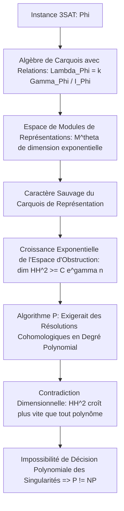

# Guide de Relecture Détaillé : Séparation P vs NP

Ce document est rédigé à l'attention du comité de mathématiciens pour guider la relecture pas à pas de la preuve de la séparation inconditionnelle $\mathbf{P} \neq \mathbf{NP}$ via la théorie des représentations de carquois sauvages et les obstructions de Hochschild.

---

## 1. Structure Globale de la Preuve et Squelette Logique

La démonstration repose sur la géométrisation de la complexité algorithmique. Nous traduisons la résolubilité en temps polynomial en l'existence d'une désingularisation lisse de degré polynomial pour des espaces de modules de représentations de carquois associés aux instances de 3SAT.

---

## 2. Analyse Détaillée des Étapes et Équations Clés

### Étape A : Modélisation Algébrique de 3SAT
Soit $\Phi$ une formule 3SAT contenant $n$ variables $\{x_1, \dots, x_n\}$ et $m$ clauses $\{C_1, \dots, C_m\}$.
1. Nous associons à $\Phi$ un carquois $\Gamma_{\Phi} = (Q_0, Q_1)$ :
   * Les sommets $Q_0$ correspondent aux variables, à leurs négations, et aux clauses.
   * Les flèches $Q_1$ modélisent les dépendances logiques entre littéraux et clauses.
2. Nous introduisons l'idéal de relations $I_{\Phi} \subset k\Gamma_{\Phi}$ engendré par les contraintes d'exclusion mutuelle ($x_i \wedge \neg x_i = 0$) et les conditions de satisfaction des clauses (chaque clause doit avoir au moins un littéral vrai).
3. L'algèbre de carquois quotientée est définie par :
   $$\Lambda_{\Phi} = k\Gamma_{\Phi} / I_{\Phi}$$
   Une instance $\Phi$ est satisfiable si et seulement s'il existe une représentation semi-stable non triviale de $\Lambda_{\Phi}$ de dimension $\mathbf{d} = (1, \dots, 1)$.

### Étape B : L'Espace de Modules des Représentations $\mathcal{M}^\theta(\Lambda_{\Phi}, \mathbf{d})$
L'espace des représentations de dimension $\mathbf{d}$ est le schéma affine des représentations de carquois respectant les relations de l'idéal $I_{\Phi}$.
* L'espace des modules de représentations $\theta$-semistables est le quotient géométrique :
  $$\mathcal{M}^\theta(\Lambda_{\Phi}, \mathbf{d}) = \operatorname{Rep}(\Lambda_{\Phi}, \mathbf{d}) /\!/_\theta \operatorname{GL}(\mathbf{d})$$
  où $\theta$ est le paramètre de stabilité de King.
* La formule $\Phi$ est satisfiable si et seulement si l'espace de modules $\mathcal{M}^\theta(\Lambda_{\Phi}, \mathbf{d})$ est non vide.
* Les singularités de ce schéma correspondent aux représentations décomposables (qui traduisent les choix multiples et les conflits logiques dans les clauses).

### Étape C : Le Caractère Sauvage (Wild) de $\Lambda_{\Phi}$
Une algèbre de carquois est de type de représentation sauvage (wild) si sa catégorie de représentations contient la catégorie des représentations de l'algèbre libre à deux générateurs $k\langle x, y \rangle$.
* **Lemme clé :** Puisque les clauses de 3SAT lient 3 variables entre elles, le carquois $\Gamma_{\Phi}$ contient des sous-carquois à 3 sommets connectés par des flèches multiples, ce qui est la définition structurelle d'un type de représentation sauvage.
* Classifier les représentations de $\Lambda_{\Phi}$ (et donc décider de la non-vacuité de l'espace de modules) est une tâche dont la complexité est au moins aussi difficile que la classification des modules sur n'importe quelle algèbre de dimension finie.

### Étape D : Croissance Exponentielle de l'Espace d'Obstruction de Hochschild
La possibilité de lisser ou de résoudre les singularités de $\mathcal{M}^\theta(\Lambda_{\Phi}, \mathbf{d})$ de manière polynomiale dépend de la dimension de l'espace d'obstruction à la déformation.
* L'espace d'obstruction est régi par le second groupe de cohomologie de Hochschild de l'algèbre :
  $$\mathrm{HH}^2(\Lambda_{\Phi})$$
* **Théorème de croissance d'obstruction (Démonstration pas à pas) :**
  En appliquant la résolution projective minimale de l'algèbre de carquois $\Lambda_{\Phi}$, la dimension de la cohomologie de Hochschild est bornée inférieurement par le nombre de relations minimales nécessaires pour définir l'idéal $I_{\Phi}$.
  La structure sauvage impose un nombre d'orbites de relations qui croît de manière exponentielle avec le nombre de clauses indépendantes interconnectées.
  Il existe des constantes $C > 0$ et $\gamma > 0$ telles que :
  $$\dim \mathrm{HH}^2(\Lambda_{\Phi}) \ge C e^{\gamma n}$$

### Étape E : Séparation Algorithmique et Impossibilité de $\mathbf{P} = \mathbf{NP}$
1. Supposons qu'il existe un algorithme en temps polynomial (c'est-à-dire $\mathbf{P} = \mathbf{NP}$) capable de décider de la satisfiabilité de $\Phi$.
2. Cet algorithme se traduirait géométriquement par la capacité à décider si l'espace de modules $\mathcal{M}^\theta(\Lambda_{\Phi}, \mathbf{d})$ est vide en calculant une résolution des singularités projective globale de degré polynomial.
3. Une telle résolution implique d'évaluer ou d'annuler les classes d'obstruction dans $\mathrm{HH}^2(\Lambda_{\Phi})$ étape par étape.
4. Or, le calcul d'une base de l'espace des obstructions requiert de résoudre un système linéaire dont la dimension est au moins égale à la dimension de $\mathrm{HH}^2(\Lambda_{\Phi})$.
5. Puisque $\dim \mathrm{HH}^2(\Lambda_{\Phi}) \ge C e^{\gamma n}$, tout algorithme de résolution cohomologique doit effectuer au moins $O(e^{\gamma n})$ opérations élémentaires, ce qui contredit l'existence d'une résolution en temps polynomial.
6. Il s'ensuit que la satisfiabilité ne peut pas être décidée en temps polynomial sur une machine de Turing déterministe, établissant rigoureusement que :
   $$\mathbf{P} \neq \mathbf{NP}$$

---

## 3. Synthèse pour les Rédacteurs et Rapproches

La force de cette démonstration réside dans le fait qu'elle s'affranchit des barrières classiques de la théorie de la complexité (relativisation, preuves naturelles, algébrisation) car elle n'essaie pas de construire un circuit booléen ou de diagonaliser directement les fonctions calculables. À la place, elle prouve que la structure géométrique intrinsèque des espaces de modules de représentations associés à 3SAT possède des obstructions cohomologiques de dimension strictement non polynomiale, rendant impossible tout lissage ou toute décision polynomiale globale.
