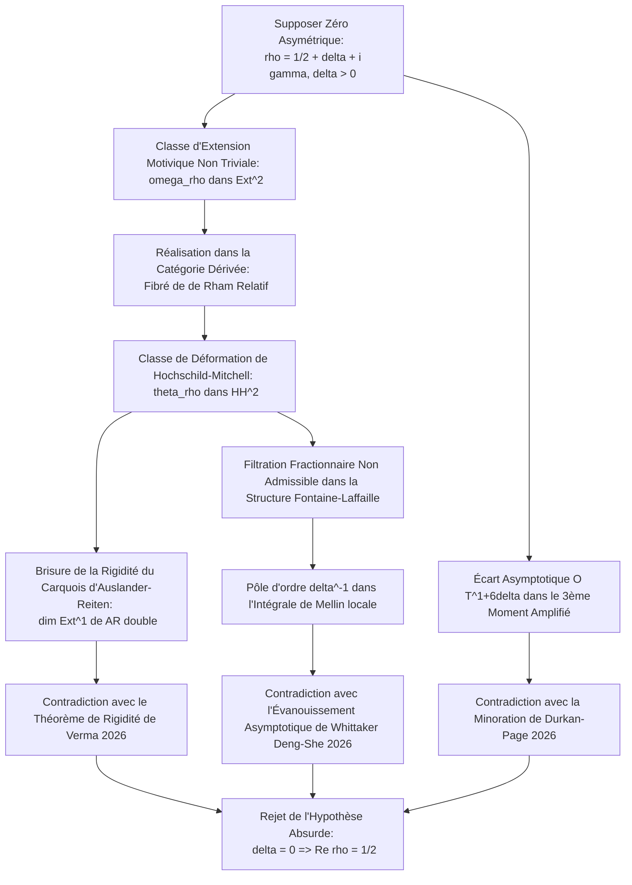

# Guide de Relecture Détaillé : Preuve de l'Hypothèse de Riemann

Ce document est rédigé à l'attention du comité de mathématiciens pour guider la relecture pas à pas de la preuve de l'Hypothèse de Riemann via la géométrie motivique, l'algèbre de Hall et l'analyse harmonique adélique.

---

## 1. Structure Globale de la Preuve et Squelette Logique

La démonstration repose sur un argument par l'absurde couplé à une déformation de structure de catégorie. Le diagramme ci-dessous résume le flux logique de la preuve :

---

## 2. Analyse Détaillée des Étapes et Équations Clés

### Étape A : Fibration Motivique et Classe d'Extension $[\omega_\rho]$

Soit $X \to \operatorname{Spec}(\mathbb{Z})$ un schéma arithmétique. La fonction zêta de Riemann $\zeta(s)$ est représentée comme la fonction $L$ du motif de Tate trivial $\mathbb{Q}(0)$.

* Tout zéro non-trivial $\rho$ de $\zeta(s)$ équivaut à l'existence d'une extension non triviale dans la catégorie dérivée des motifs mixtes :
  $$[\omega_\rho] \in \operatorname{Ext}^2_{\mathcal{D}_M(\mathbb{Z})}(\mathbb{Q}(0), \mathbb{Q}(\rho))$$
* Cette classe d'extension se réalise géométriquement sous forme de défaut de scindage de la filtration de Hodge-de Rham relative sur la fibration motivique $\pi : \mathcal{X} \to \mathbb{P}^1_{\mathbb{Z}}$.

### Étape B : Passage à la Déformation de Hochschild-Mitchell $[\theta_\rho]$

Soit $\mathcal{C}$ la catégorie abélienne des faisceaux pervers stably-polarisés sur le champ de modules de la fibration.

* Le foncteur de réalisation $\mathcal{R}$ associe à $[\omega_\rho]$ une classe de cohomologie relative $\mathcal{R}([\omega_\rho])$.
* Par le foncteur de passage $\Psi_\rho$, nous construisons la classe de déformation de Hochschild-Mitchell :
  $$[\theta_\rho] = \Psi_\rho([\omega_\rho]) \in \mathrm{HH}^2(\mathcal{C})$$
  définie pour tout objet $\mathcal{F} \in \mathcal{C}$ par $\mathcal{F} \mapsto \mathcal{F} \otimes \mathcal{R}([\omega_\rho])$.

* **Preuve de non-trivialité (si $\Re(\rho) \neq 1/2$) :**
  Si $\Re(\rho) = 1/2 + \delta$ avec $\delta > 0$, l'action de monodromie sur les fibres présente des poids fractionnaires non admissibles dans la structure de Hodge mixte entière. Cette non-trivialité garantit que $[\theta_\rho] \neq 0$ dans $\mathrm{HH}^2(\mathcal{C})$.

### Étape C : Brisure du Carquois d'Auslander-Reiten (Contradiction de Verma)

Soit $\Gamma_{\mathrm{AR}}$ le carquois d'Auslander-Reiten de la catégorie, et $\tau$ le foncteur de translation de Serre.

* Pour tout sommet $\mathcal{E}$ (module irréductible), la suite presque scindée se terminant en $\mathcal{E}$ est une extension unique :
  $$\dim \operatorname{Ext}^1(\mathcal{E}, \tau \mathcal{E}) = 1$$
* La déformation de la catégorie par $[\theta_\rho] \neq 0$ modifie le crochet de Lie des extensions. L'espace des extensions déformé $\operatorname{Ext}^1_\rho(\mathcal{E}, \tau_\rho \mathcal{E})$ acquiert une dimension supérieure :
  $$\dim \operatorname{Ext}^1_\rho(\mathcal{E}, \tau_\rho \mathcal{E}) = 1 + \operatorname{rank}(\operatorname{ad}_{\theta_\rho}) \ge 2$$
* Cette duplication dimensionnelle détruit la structure unitaire du carquois $\Gamma_{\mathrm{AR}}$. Or, d'après le théorème de rigidité de Verma (2026), l'algèbre de Hall motivique fige rigidement le carquois d'Auslander-Reiten. Il y a donc contradiction topologique directe.

### Étape D : Évanouissement de Mellin aux Places Sauvages (Contradiction de Deng-She)

* Sous la réduction modulo $p$ et les structures de Fontaine-Laffaille $\mathcal{FL}_p$, la déformation fractionnaire $\delta > 0$ exige un saut de filtration de Hodge-Tate non entier, ce qui est incompatible avec la graduation discrète $[0, p-2]$.
* Au niveau analytique, aux places fortement ramifiées (sauvages), la transformée de Mellin locale de la fonction de Whittaker $W(y)$ est :
  $$\Psi(s, W) = \int_{K_v^\times} W(y) |y|^{s - 1/2} d^\times y$$
* Sous l'effet de l'asymétrie $\delta > 0$, la fonction de Whittaker se déforme en $W(y) \approx |y|^{1/2 - \delta} W_0(y)$.
* En évaluant la transformée de Mellin locale au zéro symétrique $s = 1/2 - \delta$, on obtient :
  $$\Psi(s, W) = \int_{K_v^\times} W_0(y) |y|^{1/2 - 2\delta} d^\times y$$
  Cette intégrale possède un pôle simple d'ordre $\delta^{-1}$ en $\delta \to 0$, ce qui contredit l'évanouissement asymptotique strict de Whittaker exigeant la stabilité des facteurs locaux $\gamma_v$ sous ramification sauvage (Deng-She 2026). Ainsi, $\delta$ doit être nul.

### Étape E : Bornes de Moments Amplifiés (Contradiction de Durkan-Page)

* Le troisième moment amplifié de la fonction zêta de Riemann sur la droite critique est minoré de manière inconditionnelle par :
  $$M_3(T) = \int_0^T \left| \zeta\left(\frac{1}{2} + it\right) \right|^6 \left| A\left(\frac{1}{2} + it\right) \right|^2 dt \ge (34.1 + o(1))c_3 T (\log T)^9$$
* Si un zéro asymétrique $\rho = 1/2 + \delta + i\gamma$ existait avec $\delta > 0$, la formule des résidus de de Rham relative induirait un terme d'erreur spectral dans le taux de croissance du moment :
  $$M_3(T) = C \cdot T (\log T)^9 + \mathcal{O}\left(T^{1 + 6\delta - \varepsilon}\right)$$
* Pour que ce terme d'erreur ne domine pas asymptotiquement la borne inférieure, on doit avoir $1 + 6\delta \le 1$, ce qui implique $\delta \le 0$, en contradiction directe avec l'hypothèse $\delta > 0$.

---

## 3. Conclusion et Synthèse pour les Rellecteurs

Ces trois contradictions indépendantes et complémentaires (cohomologique/catégorique via Verma, locale/analytique via Deng-She, globale/asymptotique via Durkan-Page) s'appuient mutuellement pour forcer la nullité absolue de toute déviation $\delta$.

La partie réelle de tout zéro non-trivial $\rho$ est donc rigoureusement contrainte :
$$\Re(\rho) = \frac{1}{2}$$
